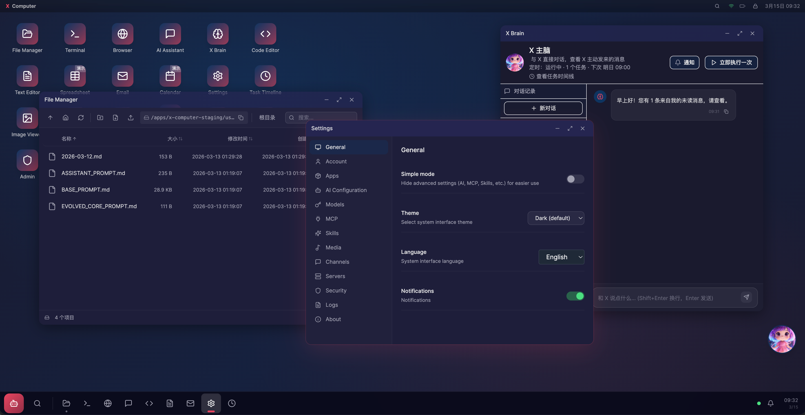

# X-Computer

<p align="center">
  <strong>AI-Powered Autonomous Computer System</strong>
</p>

<p align="center">
  <a href="#features">Features</a> •
  <a href="#quick-start">Quick Start</a> •
  <a href="#documentation">Documentation</a> •
  <a href="#contributing">Contributing</a> •
  <a href="#license">License</a>
</p>

<p align="center">
  
  
  
</p>

---



X-Computer is an AI-powered autonomous computer system featuring a web-based desktop interface with built-in office applications, and an intelligent agent that can take over and execute tasks autonomously.

## Features

- **Desktop Experience** — File manager, terminal, browser, code editor, spreadsheet, email, calendar, and more
- **AI Agent** — Every window has an "AI Takeover" button; one click lets AI handle the task
- **Four Workflows** — Chat collaboration, coding, autonomous agents, office automation
- **Dual Execution Modes** — Auto mode (continuous execution) / Approval mode (confirm critical operations)
- **Container Isolation** — Secure sandbox execution with optional VM escalation for sensitive tasks
- **Full Audit Trail** — Every AI action logged as intent-action-result triplets

## Architecture

```
┌─────────────────────────────────────────────────┐
│                  Desktop UI (Web)               │
│  Window Manager │ File Manager │ Terminal │ ... │
└────────────────────┬────────────────────────────┘
                     │ WebSocket + REST API
┌────────────────────┴────────────────────────────┐
│              Agent Orchestrator                 │
│  TaskPlanner │ ToolExecutor │ PolicyEngine      │
│  RuntimeGateway │ AuditLogger                   │
└─────────────────────────────────────────────────┘
```

## Quick Start

### Prerequisites

- Node.js 22+
- npm 9+
- Docker (optional, for container isolation)

### Installation

```bash
# Clone the repository
git clone https://github.com/RogerLiNing/x-computer.git
cd x-computer

# Install dependencies
npm install

# Copy and configure settings
cp .x-config.example.json .x-config.json
# Edit .x-config.json with your LLM API keys (OpenAI, Anthropic, etc.)

# Start development server
npm run dev

# Frontend: http://localhost:3000
# Backend API: http://localhost:4000
```

### Configuration

X-Computer supports multiple LLM providers. Edit `.x-config.json`:

```json
{
  "llm_config": {
    "providers": [
      {
        "id": "openai",
        "name": "OpenAI",
        "baseUrl": "https://api.openai.com/v1",
        "apiKey": "{env:OPENAI_API_KEY}"
      }
    ],
    "defaultByModality": {
      "chat": { "providerId": "openai", "modelId": "gpt-4o" }
    }
  }
}
```

See [Configuration Guide](docs/CONFIGURATION.md) for all options.

## Tech Stack

| Layer | Technology |
|-------|------------|
| Frontend | React 19, TypeScript, Vite, Tailwind CSS, Zustand |
| Backend | Node.js, Express 5, WebSocket |
| Orchestration | TaskPlanner, ToolExecutor, PolicyEngine |
| Isolation | Docker containers, optional Firecracker microVM |
| Database | SQLite (default) or MySQL |

## Project Structure

```
x-computer/
├── frontend/          # React desktop UI
│   └── src/
│       ├── components/
│       │   ├── desktop/   # Window system, taskbar, notifications
│       │   └── apps/      # Built-in apps (file manager, terminal, browser...)
│       └── store/         # Zustand state management
├── server/            # Node.js backend
│   └── src/
│       ├── orchestrator/  # Task planning and execution
│       ├── tooling/       # Sandbox FS/Shell, container management
│       ├── policy/        # Risk scoring and approval policies
│       ├── subscription/  # Subscription and quota management
│       └── routes/        # REST API routes
├── shared/            # Shared TypeScript types
├── workflow-engine/   # Optional workflow microservice
└── docs/              # Documentation
```

## API Reference

| Method | Endpoint | Description |
|--------|----------|-------------|
| POST | `/api/tasks` | Create and execute task |
| GET | `/api/tasks` | List all tasks |
| GET | `/api/tasks/:id` | Get task details |
| POST | `/api/tasks/:id/pause` | Pause task |
| POST | `/api/tasks/:id/resume` | Resume task |
| POST | `/api/tasks/:id/steps/:stepId/approve` | Approve step |
| GET | `/api/mode` | Get execution mode |
| POST | `/api/mode` | Set execution mode |
| GET | `/api/tools` | List available tools |
| GET | `/api/health` | Health check |

See [Development Guide](docs/DEVELOPMENT.md) for full API documentation.

## Documentation

- [Configuration Guide](docs/CONFIGURATION.md) — All configuration options
- [Development Guide](docs/DEVELOPMENT.md) — API reference and development tips
- [Deployment Guide](docs/DEPLOYMENT_QUICKSTART.md) — Deploy to production
- [Security Guide](docs/SECURITY_HARDENING_COMPLETE.md) — Security best practices

## Testing

```bash
# Run all tests
npm run test

# Run tests in watch mode
cd server && npm run test:watch
```

## Contributing

We welcome contributions! Please see our [Contributing Guide](CONTRIBUTING.md) for details.

- Report bugs via [Issues](https://github.com/your-username/x-computer/issues)
- Propose features via [Discussions](https://github.com/your-username/x-computer/discussions)
- Submit code via [Pull Requests](https://github.com/your-username/x-computer/pulls)

Please read our [Code of Conduct](CODE_OF_CONDUCT.md) before contributing.

## License

This project is licensed under the MIT License - see the [LICENSE](LICENSE) file for details.

---

<p align="center">
  Made with ❤️ by the X-Computer community
</p>
